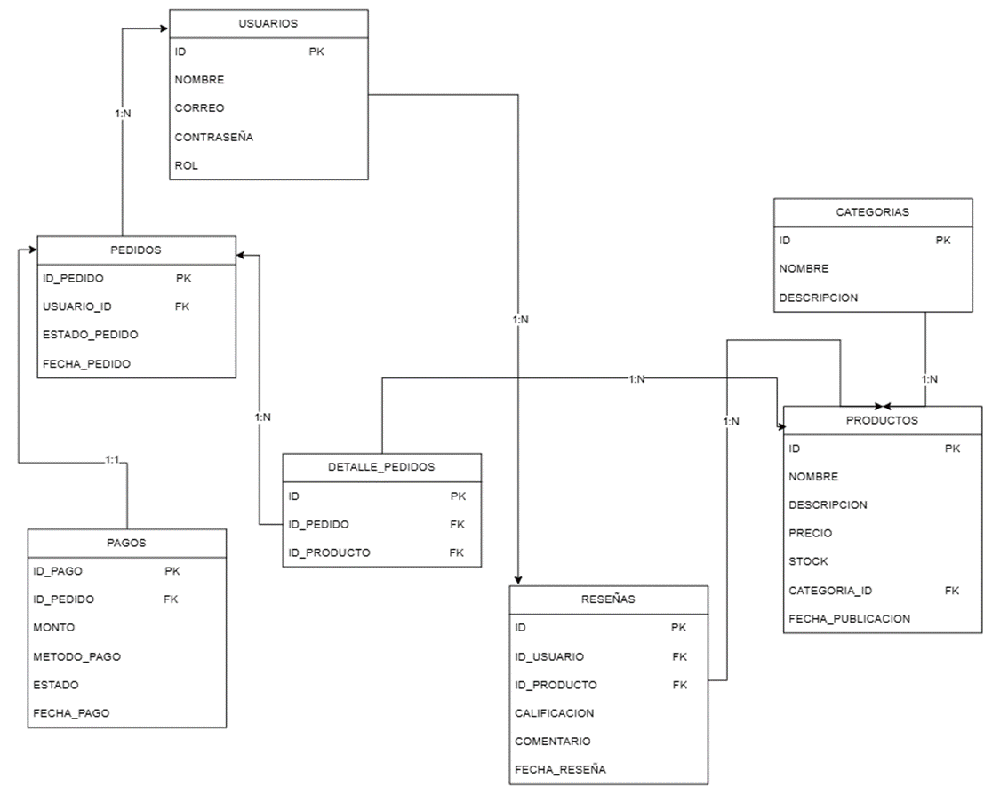

# E-Commerce API

# Descripción del proyecto
API REST para un sistema de e-commerce desarrollada con Node.js y Express, con base de datos SQLite. Permite gestionar usuarios, categorías, productos, pedidos, detalle de pedidos, pagos y reseñas.

# URL en producción
https://e-commerce-ig02.onrender.com

# Autenticación
Todas las rutas requieren el siguiente header:
password: arrozconpollo

## Modelo de datos (Diagrama ER)

## Endpoints por tabla

# /usuarios
| Método | Ruta | Descripción |
|--------|------|-------------|
| GET | /usuarios | Listar todos |
| GET | /usuarios/:id | Buscar por ID |
| POST | /usuarios | Crear nuevo |
| PUT | /usuarios/:id | Reemplazar |
| DELETE | /usuarios/:id | Eliminar |

# /categorias
| Método | Ruta | Descripción |
|--------|------|-------------|
| GET | /categorias | Listar todas |
| GET | /categorias/:id | Buscar por ID |
| POST | /categorias | Crear nueva |
| PUT | /categorias/:id | Reemplazar |
| DELETE | /categorias/:id | Eliminar |

# /productos
| Método | Ruta | Descripción |
|--------|------|-------------|
| GET | /productos | Listar todos |
| GET | /productos/:id | Buscar por ID |
| POST | /productos | Crear nuevo |
| PUT | /productos/:id | Reemplazar |
| DELETE | /productos/:id | Eliminar |

# /pedidos
| Método | Ruta | Descripción |
|--------|------|-------------|
| GET | /pedidos | Listar todos |
| GET | /pedidos/:id | Buscar por ID |
| POST | /pedidos | Crear nuevo |
| PUT | /pedidos/:id | Reemplazar |
| DELETE | /pedidos/:id | Eliminar |

# /detalle-pedidos
| Método | Ruta | Descripción |
|--------|------|-------------|
| GET | /detalle-pedidos | Listar todos |
| GET | /detalle-pedidos/:id | Buscar por ID |
| POST | /detalle-pedidos | Crear nuevo |
| PUT | /detalle-pedidos/:id | Reemplazar |
| DELETE | /detalle-pedidos/:id | Eliminar |

# /pagos
| Método | Ruta | Descripción |
|--------|------|-------------|
| GET | /pagos | Listar todos |
| GET | /pagos/:id | Buscar por ID |
| POST | /pagos | Crear nuevo |
| PUT | /pagos/:id | Reemplazar |
| DELETE | /pagos/:id | Eliminar |

# /resenas
| Método | Ruta | Descripción |
|--------|------|-------------|
| GET | /resenas | Listar todas |
| GET | /resenas/:id | Buscar por ID |
| POST | /resenas | Crear nueva |
| PUT | /resenas/:id | Reemplazar |
| DELETE | /resenas/:id | Eliminar |

# Tecnologías utilizadas
- Node.js
- Express.js
- better-sqlite3
- dotenv
- Render (despliegue)

# Instrucciones para correr localmente
1. Clonar el repositorio
   git clone https://github.com/sebas-gonzalez21/E-commerce.git

2. Instalar dependencias
   npm install

3. Crear archivo .env con:
   password = arrozconpollo

4. Iniciar en desarrollo
   npm run dev

# Integrantes
Yhojan Andres Caro Gonzalez | Johan Sebastian Gonzalez Cartagena
